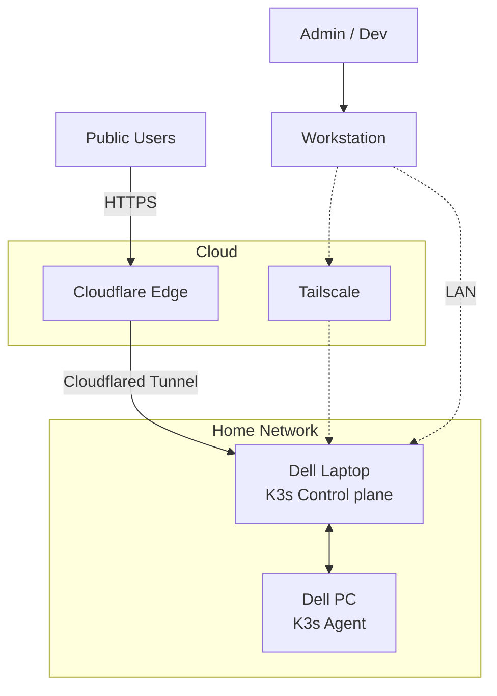
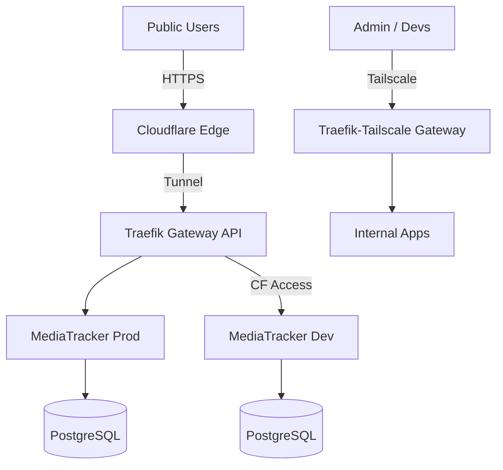

# Sock1000kg Homelab

Infrastructure as Code (IaC) repository for my bare-metal Kubernetes homelab.

## Table of Contents

- [Architecture Overview](#architecture-overview)
- [Tech Stack & Key Components](#tech-stack--key-components)
- [Repository Structure](#repository-structure)
- [Operations](#operations)
- [Planned Components](#planned-components)

## Architecture Overview

The homelab utilizes a split-access model where public traffic routes through Cloudflare, and internal/administrative traffic routes through Tailscale or WireGuard.

### Network Topology



### System architecture



## Tech Stack & Key Components


### Hardware

- **Workstation:** My personal laptop 
- **Bare-Metal Server:** Dell Inspiron 15-3567 (Ubuntu Server)  
- **Observability Node:** Dell PC (Ubuntu Server)


### Infrastructure & Automation

- **Kubernetes:** K3s (Single Node)  
- **IaC:** Terraform (Azure provisioning with local state - experiment only)  
- **Configuration Management:** Ansible (Server baselining, VPN configuration, K3s bootstrapping)  
- **Automation:** Python CLI (`vpn_manager`) to dynamically spin up/down the Azure WireGuard Hub - experiment only


### Networking

- **Ingress Controller:** Traefik (Gateway API)
- **Public Access:** Cloudflare Tunnel -> Traefik
- **Internal Access:** Tailscale Kubernetes Operator → Traefik
- **Peering:** WireGuard (Hub-and-Spoke architecture via Azure) - experiment only

### GitOps & Secrets

- **Cluster Management:** Kustomize (Base/Overlay pattern for Dev and Prod environments), Helm (Generate vendor charts and applied via Kustomize) 
- **Secret Management:**  
  - Bitnami Sealed Secrets (for Kubernetes manifests)  
  - Mozilla SOPS + Age (for Ansible inventory and variable encryption)


### Hosted Services

- **MediaTracker:** Full-stack media management platform (Node.js/TypeScript backend). Deployed across isolated `dev` and `prod` namespaces.
- **Databases:** Bitnami PostgreSQL
- Wordpress: My personal website
- Jellyfin: Media player


## Repository Structure
```
.
├── infra/
│   ├── ansible/          # Playbooks for K3s, Tailscale, WireGuard, and base dependencies
│   ├── automation/       # Python tool to spin up/down the Azure VPN Hub and update inventories
│   └── terraform/        # Azure infrastructure definitions (Network, Compute, Security Groups,...)
└── k8s/
    ├── base/             # Base Kustomize manifests (Traefik, Cloudflared, Postgres, Apps)
    └── overlays/         # Environment-specific patches
        ├── dev/          # Development environment (Protected by Cloudflare Access)
        └── prod/         # Production environment
```


## Operations

Because the Azure B1s node incurs costs, the experimental architecture is designed to spin up the cloud VPN hub on demand using a custom Python automation script.

### Spin Up the VPN Hub

Navigate to the automation directory and use the custom CLI tool:

```bash
cd infra/automation
python3 -m vpn_manager.cli bootstrap
```
This command:
- Applies Terraform
- Extracts the dynamic Public IP
- Updates the Ansible inventory
- Runs the WireGuard hub/client configuration playbooks and outputs the hub's public IP and public key. The client will copy these into the workstation's WireGuard interface.
### Verify Connectivity
Ensure the WireGuard tunnels are active:
```bash
python3 -m vpn_manager.cli verify
```
## Planned Components
- Automated GitOps with ArgoCD with full SOPS adoption
- More services
- Database backups
- Chaos Testing
